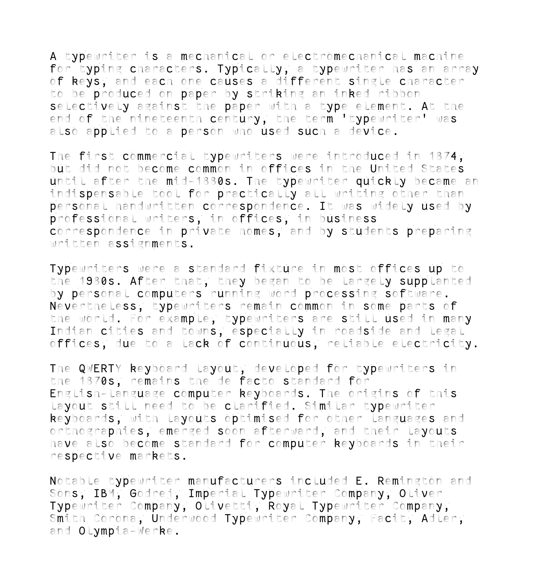
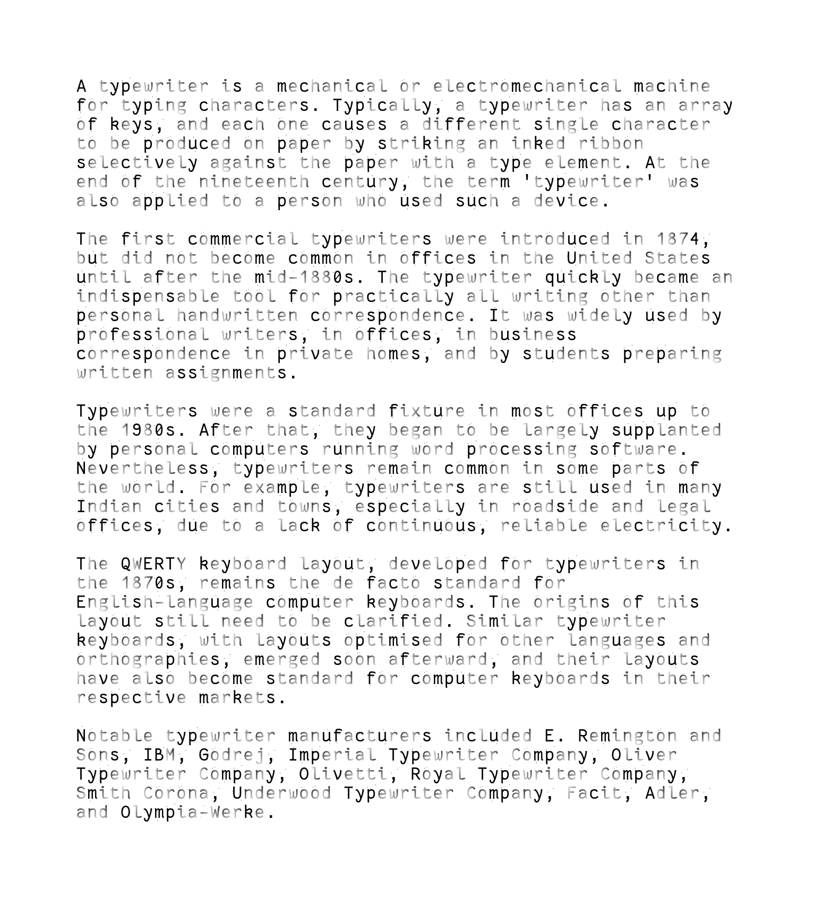
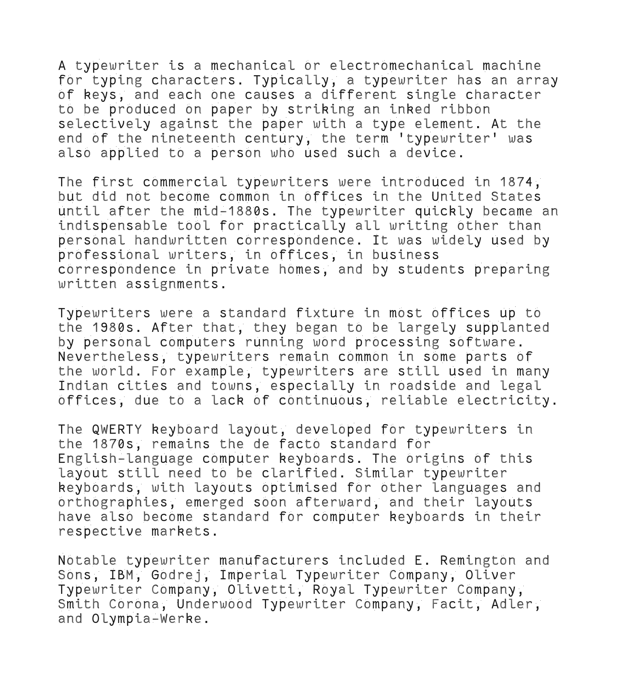

# mingkuai-ascii
A simple typewriter-effect image generator. Named after [_Mingkuai Chinese Typewriter_](https://en.wikipedia.org/wiki/Chinese_typewriter#Ming_Kwai_typewriter).

## Requirements
- Python 3.?
- PIL

## Usage
- `genFont.py`: reads a specified font and stores images of characters in `assets\pic\`
- `render.py inputTextName outputImageName`: renders an image, storing into `outputImageName.png`

## Features
- despites the random effects cast on the glyphs, same characters are rendered the same
- alter the variables (e.g. `dim`, `ful`, `defaultRandSeed`) to get different results

## Samples
| Code | Result |
| ----------- | ----------- |
| `dim=0.01` `ful=0.99` |  |
| `dim=0.01` `ful=0.99` `sqrt` |  |
| `dim=0.50` `ful=0.90` `sqrt` |  |
- here `sqrt` stands for `newPixel=tuple(int(i*math.sqrt(coeffW*coeffH)) for i in imagePixel)`; you'll have to read line `31`-`50` of `render.py` to understand its meaning

## References
- Font used for demonstration purposes: [belluzj/fantasque-sans](https://github.com/belluzj/fantasque-sans)
- Text used for demonstration purposes: [Typewriter](https://en.wikipedia.org/wiki/Typewriter) from Wikipedia, [_(revision 1190208273)_](https://en.wikipedia.org/w/index.php?title=Typewriter&oldid=1190208273)
